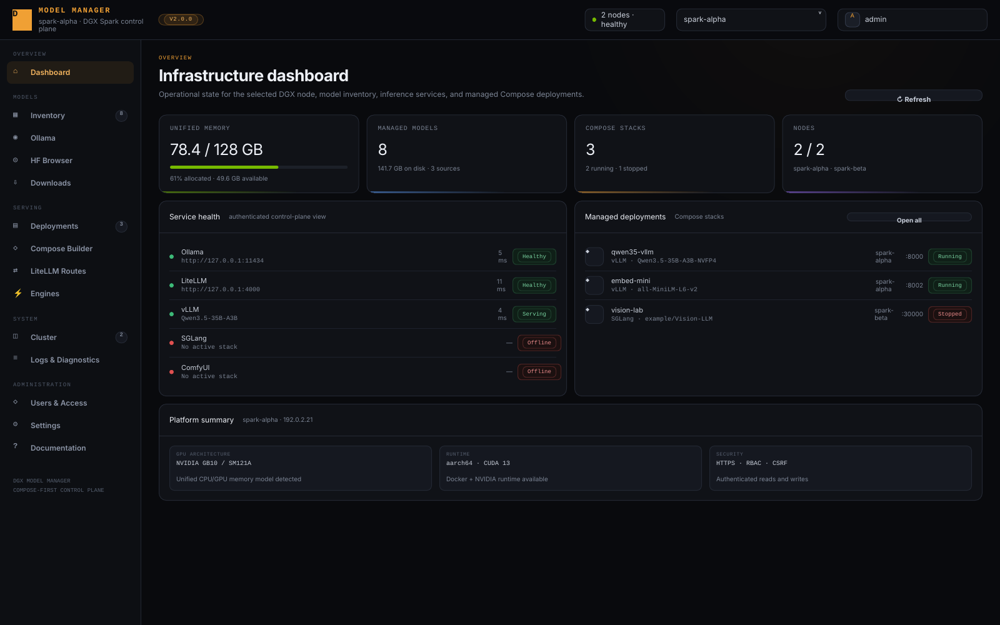
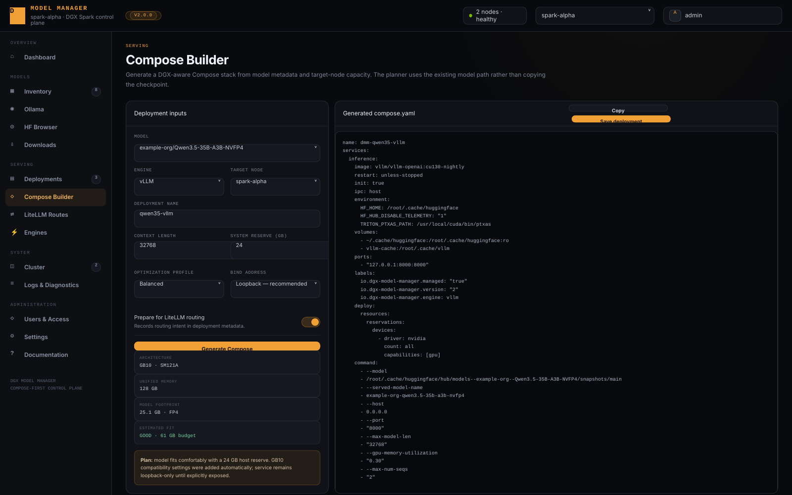
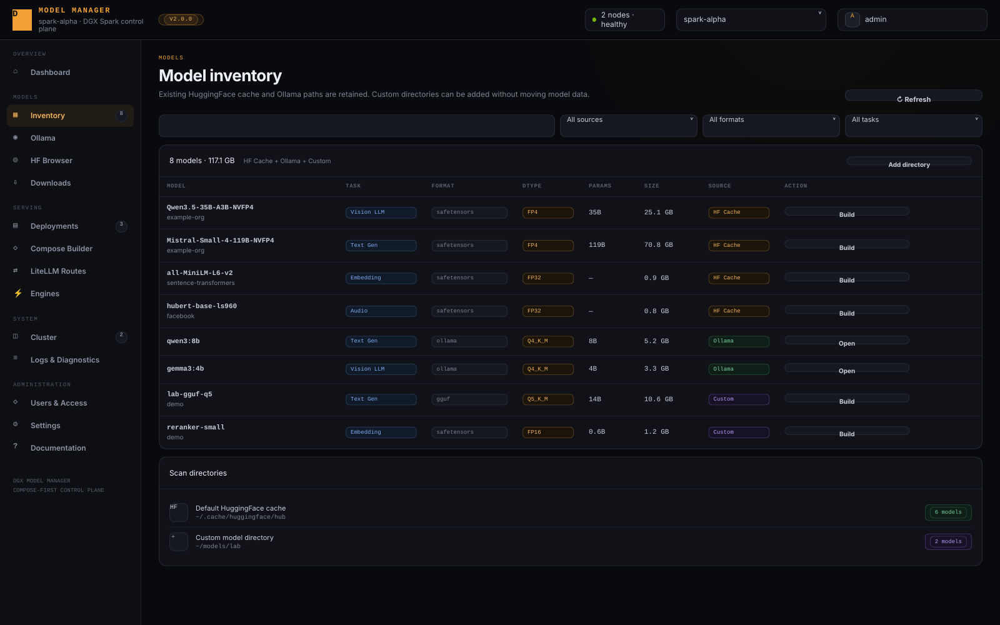
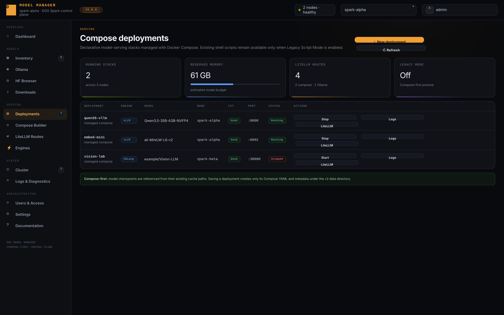
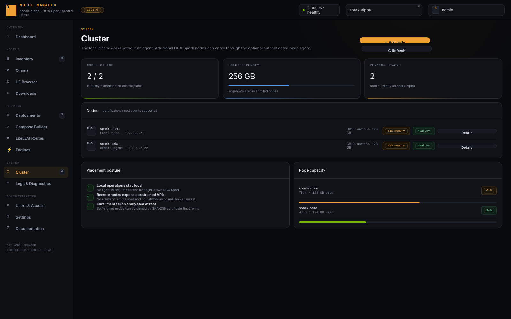
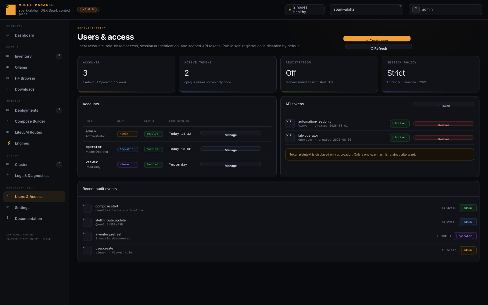

# DGX Model Manager v2

DGX Model Manager v2 is a secure, Compose-first control plane for NVIDIA DGX Spark model operations.

It provides one authenticated web interface for:

- local Hugging Face model inventory
- Ollama model discovery and downloads
- Hugging Face search, file inspection, download, and deletion
- DGX-aware Compose generation
- saved deployment lifecycle management
- serving-engine discovery
- LiteLLM routing and configuration visibility
- host, Docker, and service diagnostics
- users, roles, API tokens, and audit history
- optional multi-node DGX Spark management

The manager controls model-serving infrastructure. It does **not** proxy inference traffic itself.

Version: **2.0.0**

---

## Screenshots

### Dashboard



### Compose Builder



### Model inventory



### Compose deployments



### Cluster management



### Users and access



---

## Major v2 capabilities

### Model inventory

DGX Model Manager scans the standard Hugging Face cache and optional custom model directories.

Inventory metadata includes, where determinable:

- model owner and repository
- task / modality classification
- checkpoint format
- base dtype
- checkpoint precision
- quantization implementation and format
- mixed quantization metadata
- logical parameter count
- physical local storage usage

Hugging Face cache accounting de-duplicates shared blob/snapshot inodes so model storage totals reflect physical local usage rather than counting cache links multiple times.

Metadata-only Hugging Face cache entries are excluded from installed-model inventory.

For non-quantized Safetensors checkpoints, parameter counts and dtype information are derived directly from Safetensors headers without loading tensor data.

Quantized derivatives can resolve logical parameter counts from their declared upstream base model rather than treating packed checkpoint tensor shapes as full-precision logical parameter counts.

Remote Hugging Face enrichment is cached locally and is optional: an unavailable network does not break local inventory.

---

## Requirements

### Tested manager platform

The 2.0.0 hardware acceptance run was performed on:

- NVIDIA DGX Spark
- NVIDIA GB10
- Linux / aarch64
- Docker + Docker Compose
- NVIDIA Container Toolkit
- Python 3.12
- systemd 255

Other compatible Linux hosts may work, but DGX Spark / GB10 is the primary target.

### Required software

- Python 3.10+
- Docker Engine
- Docker Compose plugin
- NVIDIA Container Toolkit for GPU-serving deployments
- systemd for the supplied service installer
- network access to Hugging Face for search/download/enrichment features

Ollama and LiteLLM are optional integrations.

---

## Safe side-by-side installation

v2 is designed to be tested beside an existing Model Manager installation.

Defaults are intentionally isolated:

- HTTPS port: `8091`
- systemd service: `model-manager-v2.service`
- config: `~/.config/dgx-model-manager-v2/config.json`
- application data: `~/.local/share/dgx-model-manager-v2`
- Compose state: `~/.local/share/dgx-model-manager-v2/compose`

Extract or clone the project into a separate directory and run:

```bash
bash setup.sh
```

The installer creates a Python virtual environment, installs dependencies, creates an example-derived local configuration, generates bootstrap TLS material when needed, and can install an independent systemd service.

The existing v1 service is not replaced during the side-by-side installation.

After setup, open:

```text
https://<dgx-host>:8091
```

The generated certificate is self-signed unless you replace it with a trusted certificate.

---

## First administrator bootstrap

A fresh installation has no default password.

`setup.sh` generates a one-time administrator bootstrap token locally. The token is stored mode `0600`, printed during installation, and deleted after successful bootstrap.

The first administrator therefore requires possession of the host-local bootstrap token rather than merely LAN access to a new installation.

---

## Existing model paths

The default Hugging Face cache remains:

```text
~/.cache/huggingface/hub
```

The default LiteLLM configuration path remains:

```text
~/litellm/litellm_config.yaml
```

Models remain in their existing storage locations. DGX Model Manager references them in place.

Custom model directories can be added from Inventory. Arbitrary system-root locations are rejected by the path-safety policy.

---

## Ollama

DGX Model Manager talks to an existing Ollama service rather than owning Ollama storage.

Supported operations include:

- health discovery
- installed model listing
- pull/download
- delete

An empty Ollama installation is a valid state.

---

## Hugging Face browser and downloads

The Hugging Face browser supports:

- repository search
- task filtering
- popularity sorting
- repository file listing with file sizes
- discovery of likely quantized variants
- direct download to the normal Hugging Face cache or an approved custom directory

Downloads stream progress to the browser using server-sent events.

Downloaded models appear in Inventory after completion.

Deletion operates on the selected local model directory and requires browser confirmation.

---

## Compose Builder

Compose Builder converts discovered model metadata and target-node capacity into a deployment plan.

Inputs include:

- model
- serving engine
- target node
- context length
- host memory reserve
- optimization profile
- bind address
- optional LiteLLM routing preparation

Generated plans include:

- Docker image
- model mount
- engine command
- context settings
- GPU reservation
- served-model name
- memory-fit estimate
- network exposure
- generator decision notes

### Generated-plan integrity

Generated YAML is intentionally **not editable in the web UI**.

When a plan is saved, the backend preserves its trusted generated structure rather than accepting arbitrary Compose YAML supplied by the browser.

This prevents the Compose Builder from becoming an arbitrary container-definition or host-mount injection interface.

Advanced users can edit saved Compose files directly on the host after generation if they explicitly choose to take responsibility for those changes.

---

## Collision-aware ports

Each engine has a preferred host port, but v2 checks:

1. host ports reserved by already-saved v2 deployments; and
2. ports actually available for binding on the host.

If the preferred port is unavailable, the generator searches subsequent ports and records the reassignment in its decision notes.

The container's internal service port remains unchanged.

This allows a v2 deployment to coexist with an already-running external service without silently colliding with it.

---

## Quantization handling

Inventory keeps several concepts separate:

- base model dtype
- checkpoint storage precision
- quantizer implementation
- quantization format
- quantization bit widths
- mixed-quantization state

For example, an NVFP4 derivative can still have a BF16 base model while the local checkpoint is stored in FP4 or a mixture such as FP4/FP8.

vLLM plans rely on checkpoint auto-detection instead of blindly forcing a quantization mode.

SGLang receives explicit loader arguments only when the metadata is sufficiently specific.

llama.cpp requires compatible GGUF input.

---

## Runtime memory estimate

Compose Builder presents an estimated runtime footprint and compares it with the selected host memory reserve.

The estimate is a planning aid, not a hard resource guarantee. Actual KV-cache and runtime memory requirements vary by architecture, context length, concurrency, engine version, kernel implementation, and quantization.

For DGX Spark's unified-memory architecture, leave meaningful host reserve rather than allocating the entire system to model serving.

---

## Compose deployments

Saving a deployment writes:

```text
~/.local/share/dgx-model-manager-v2/compose/stacks/<engine>/<slug>/
├── compose.yaml
└── deployment.json
```

**Saving does not start the deployment.**

Saved deployments can be:

- validated
- started
- stopped
- inspected
- logged
- routed to LiteLLM when supported
- archived

Archive performs Compose down for the managed stack and moves its YAML/metadata into the archive directory.

Model checkpoint files are not deleted.

Deployment logs open in an operations-sized viewer suitable for longer engine output.

---

## Service ownership boundary

DGX Model Manager distinguishes between:

- a service that is detectable at a configured endpoint; and
- a deployment that is actually managed by v2.

This distinction is intentional.

An externally managed vLLM, ComfyUI, or other service may appear **Online**, but v2 will not stop it merely because it occupies the expected engine port.

The Serving Engines **Stop** control is enabled only for a running v2-managed Compose deployment.

The backend independently enforces the same rule and refuses to stop an externally managed service.

---

## LiteLLM integration

LiteLLM can remain the unified OpenAI-compatible gateway for Ollama and generated model-serving deployments.

The Routing page provides:

- active `/v1/models` route discovery
- redacted LiteLLM configuration display
- optional Ollama wildcard creation
- deployment route add/remove support

### Authenticated LiteLLM

If LiteLLM protects `/health` and `/v1/models`, v2 can use the existing `LITELLM_MASTER_KEY` without exposing the broader LiteLLM environment to the application.

During setup, the optional LiteLLM authentication integration copies **only** the master key into a root-owned systemd credential and attaches it with:

```ini
LoadCredential=litellm_master_key:/etc/dgx-model-manager-v2/litellm_master_key
```

The application reads that credential from systemd's runtime credentials directory.

It does not need read access to a broader environment file containing unrelated values such as database or salt credentials.

The LiteLLM credential remains server-side and is never returned to the browser.

### LiteLLM restart permission

Routing changes can require a LiteLLM restart.

`setup.sh` can optionally install a narrowly scoped sudo rule allowing the Model Manager service user to run only the required LiteLLM systemctl restart command.

This capability is opt-in.

---

## Secret redaction

Configuration returned to the browser is recursively redacted.

Sensitive keys such as:

- `api_key`
- `master_key`
- passwords
- secrets
- authorization values
- credential fields
- token fields such as `access_token`

are replaced with:

```text
***REDACTED***
```

The matcher uses security-relevant key names rather than broad substring matching, so benign settings such as:

```yaml
max_tokens: 4096
```

remain visible.

---

## Accounts and roles

Three roles are available:

| Role | Observe | Operate | Administer |
|---|---:|---:|---:|
| Viewer | Yes | No | No |
| Operator | Yes | Yes | No |
| Admin | Yes | Yes | Yes |

Admins can manage users and issue API tokens.

Browser sessions use opaque HttpOnly cookies plus CSRF protection.

Passwords are stored using Argon2id hashes.

### Administrator lockout protection

The backend enforces that at least one active administrator remains.

An administrator cannot:

- disable their own active account; or
- disable/demote the last active administrator.

The Users & Access page mirrors those invariants by disabling invalid controls and identifying the signed-in account with a **You** badge.

---

## API tokens

Admins can create scoped API tokens.

A token has a maximum assigned role and can never exercise authority above its owner's current effective role.

Tokens are displayed once at creation and should be stored in a secrets manager.

---

## Audit log

Administrative and mutating actions are recorded in the application audit log, including events such as:

- bootstrap
- user changes
- API-token changes
- model download/delete
- Compose save/archive
- LiteLLM route changes
- settings changes

---

## Settings

Settings exposes:

- application behavior
- default Compose parameters
- service endpoints
- engine images
- security summary

Service endpoint tests provide both:

- a toast notification; and
- a persistent inline success/failure indicator with latency or HTTP/error status.

Canonical service names are used throughout the UI:

- Ollama
- LiteLLM
- SGLang
- vLLM
- llama.cpp
- LocalAI
- ComfyUI

Saving unchanged settings is safe and does not automatically restart serving engines.

---

## Security model: treat the LAN as untrusted

DGX Model Manager does not treat local-network access as authorization.

Important controls include:

### Authentication

Read-only operational data is authenticated.

Anonymous LAN users cannot retrieve inventory, service topology, routes, logs, or host diagnostics.

### HTTPS

Non-loopback deployment is HTTPS-first.

The installer can generate a bootstrap self-signed certificate; replace it with a trusted certificate when appropriate.

### CSRF

Browser mutations require CSRF protection in addition to authentication.

### SSRF policy

Configured service targets are restricted to safe local/private destinations by default.

Public, multicast, unspecified, and unsafe link-local targets are blocked unless policy is explicitly changed.

### Docker authority

The web application never exposes the Docker socket over the network.

Local Docker access remains powerful and must be protected by the host operating system.

### Compose trust boundary

The generator does not accept arbitrary user-edited YAML through its normal save API.

### Secrets

Runtime credentials, TLS private keys, local configuration, databases, environment files, and generated tokens are excluded from the public repository and release archives.

---

## Legacy Script Mode

Legacy `start_*.sh` workflows remain available as an opt-in compatibility feature.

Legacy Script Mode is disabled by default.

When enabled, matching scripts can appear as serving profiles while operators transition to Compose-managed deployments.

Legacy scripts are arbitrary executable code. Enable this mode only for scripts you trust.

---

## Multi-node DGX Spark

The host running the web application is the local node and requires no agent.

Additional DGX Spark systems can run the restricted node agent:

```bash
bash setup-agent.sh
```

The agent supports:

- node information
- dashboard metrics
- model inventory
- Compose generation
- managed deployment lifecycle

It does not expose a general-purpose remote shell.

For self-signed agent TLS, certificate fingerprint pinning is required when normal CA verification is disabled.

### Validation status

The local-node cluster path was hardware-tested during the 2.0.0 acceptance run.

Remote-node enrollment and lifecycle paths are implemented and covered by software tests, but were **not hardware-validated against a second physical DGX Spark before the 2.0.0 publication**.

Feedback from multi-Spark operators is therefore particularly useful.

---

## Diagnostics

Logs & Diagnostics includes:

- host information
- Python/runtime information
- Docker and Compose readiness
- application uptime
- in-memory application logs
- LiteLLM journal output
- Docker container discovery

Container discovery is observational and does not imply ownership.

---

## Configuration

The public repository contains:

```text
config.example.json
```

Runtime configuration is created locally as:

```text
~/.config/dgx-model-manager-v2/config.json
```

Runtime configuration is deliberately excluded from Git and release archives.

Do not commit real credentials, certificates, local databases, or host-specific runtime state.

---

## Example service configuration

See:

```text
config.example.json
```

for defaults.

Typical service endpoints use loopback addresses:

```json
{
  "services": {
    "ollama_base": "http://127.0.0.1:11434",
    "litellm_base": "http://127.0.0.1:4000",
    "vllm_base": "http://127.0.0.1:8000",
    "comfyui_base": "http://127.0.0.1:8188"
  }
}
```

---

## Migration from v1

The migration helper can inspect an existing installation and import compatible settings:

```bash
python3 scripts/migrate_from_v1.py --help
```

Migration can preserve compatible service URLs, inventory paths, and optional legacy-script visibility.

The source installation is not overwritten by the migration helper.

---

## Promotion

After side-by-side validation, use:

```bash
python3 scripts/promote_v2.sh --help
```

Review the dry-run output before replacing an existing production service.

Promotion should be treated as a separate operational decision from installing or testing v2.

---

## Build release archives

Run:

```bash
bash scripts/build_release.sh
```

The release builder:

1. performs offline release validation;
2. stages only publishable material;
3. excludes runtime state, secrets, maintainer-only acceptance files, and stale archives;
4. creates a per-file `MANIFEST.sha256` inside the archive;
5. creates `.tar.gz` and `.zip` release packages;
6. creates SHA-256 checksum files for both packages.

Output is written to:

```text
dist/
```

---

## Development validation

Install development requirements:

```bash
python3 -m pip install -r requirements-dev.txt
```

Run the test suite:

```bash
pytest -q
```

Run release validation:

```bash
python3 scripts/validate_release.py
```

Validate shell syntax:

```bash
bash -n setup.sh
bash -n setup-agent.sh
bash -n scripts/build_release.sh
```

---

## 2.0.0 hardware acceptance summary

The release was exercised side-by-side with existing model-serving workloads on a DGX Spark.

Validated live:

- installer/bootstrap
- HTTPS/authentication
- dashboard metrics
- authenticated LiteLLM health
- model inventory
- Hugging Face metadata enrichment
- Hugging Face search and file sizes
- Hugging Face download/delete
- Ollama empty-state discovery
- Compose generation
- collision-aware port allocation
- Compose save without launch
- Compose config validation
- stopped-state discovery
- deployment logs
- deployment archive
- LiteLLM route discovery/config display
- serving-engine discovery
- external-service ownership protection
- local-node cluster display
- diagnostics
- users/access safeguards
- settings endpoint testing
- settings persistence
- documentation UI

Deferred during the live acceptance session to avoid disrupting an active inference workload:

- launching/stopping a new v2-managed GPU-serving deployment
- mutating/restarting LiteLLM routes during active use
- second-physical-node hardware validation

These are explicit validation gaps, not claims of completed hardware testing.

---

## Repository structure

```text
.
├── app.py
├── agent.py
├── config.example.json
├── engine_catalog.yaml
├── dgx_manager/
├── docs/
├── docs.html
├── misc/screenshots/
├── scripts/
├── static/
├── templates/
├── tests/
├── tools/
├── setup.sh
└── setup-agent.sh
```

Runtime configuration, local databases, TLS material, acceptance plans, and generated release packages are intentionally excluded by `.gitignore`.

---

## Contributing

See [CONTRIBUTING.md](CONTRIBUTING.md).

When changing engine behavior, security boundaries, model metadata logic, or Compose generation, include regression tests and update the relevant documentation.

---

## Security

See [SECURITY.md](SECURITY.md).

Do not open a public issue containing credentials, private keys, access tokens, or sensitive host information.

---

## License

See [LICENSE](LICENSE).

---

## Related documentation

- [Architecture](docs/ARCHITECTURE.md)
- [Compose Builder](docs/COMPOSE_BUILDER.md)
- [Upgrade / side-by-side procedure](docs/UPGRADE.md)
- [Release notes](RELEASE_NOTES.md)
- [Changelog](CHANGELOG.md)
